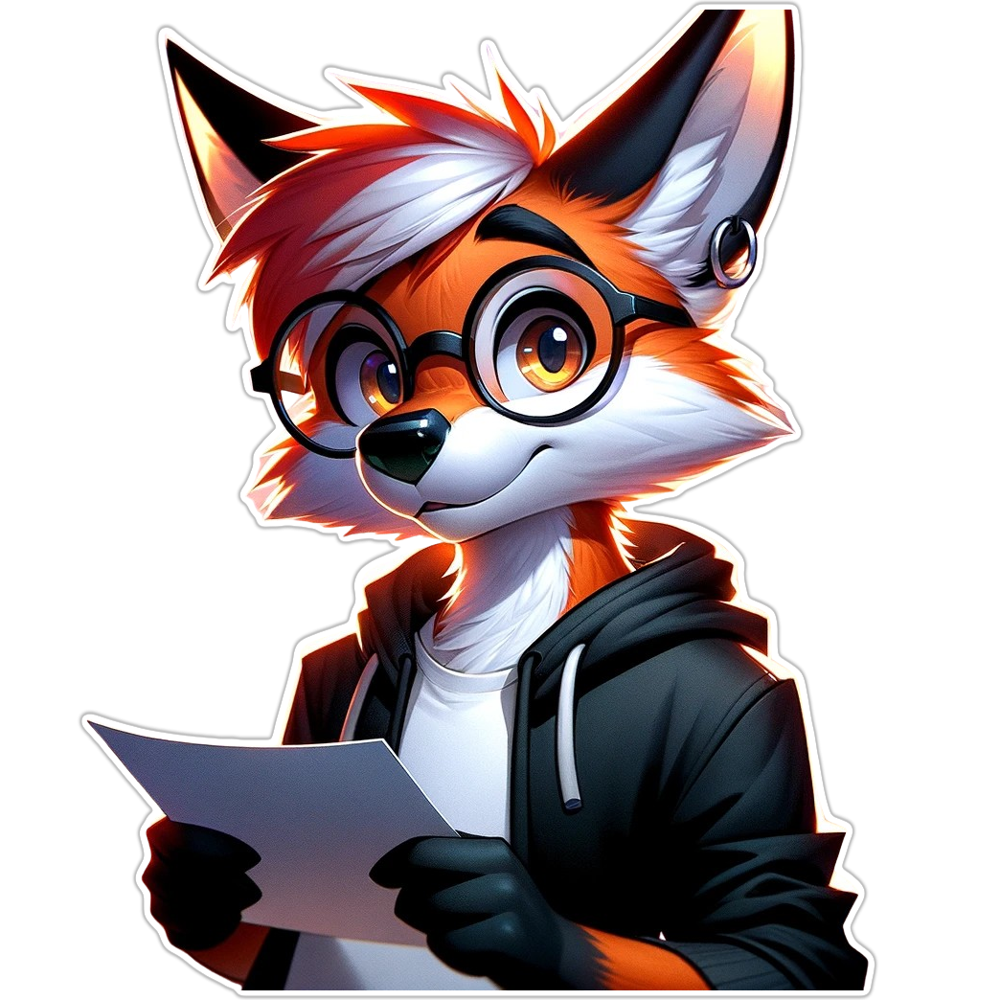

&nbsp;

  :fox_face: Olá, pode me chamar de **Hans** se preferir. 

Atualmente curso *bacharelado* em **Engenharia de Software**, estudo (por conta própria), **Desenvolvimento de sistemas**  e **Qualidade de Software** nas horas vagas.

Sinta-se à vontade para me convidar para um bate-papo, gosto de aprender coisas novas e ensinar também, quando possível. 

<!-- Contact links -->
&nbsp;

&nbsp;

<!-- Section separator -->

  &nbsp;
   
  
   
  &nbsp;

<!-- Sticker -->

<!-- A simple list of what I like and my goals -->

  :fox_face: Um pouco mais sobre mim 

 Me chamo **Wederson**, porém, conhecido como **Hanssell** ou **Hanssell a raposa** nas redes sociais. 
  
 Estudante de **Engenharia de Software**, focado em **Desenvolvimento de Sistemas**, **Qualidade de software** e **Segurança de processos**. 

 Sempre lendo artigos e livros sobre **desenvolvimento** e **boas práticas** 

 Gosto de usar qualquer qualquer tipo de tecnologia quando estou praticando em meus projetos pessoais. 

 Admiro **raposas**, amo um bom :coffee: **café** e **aprender** coisas novas. 

