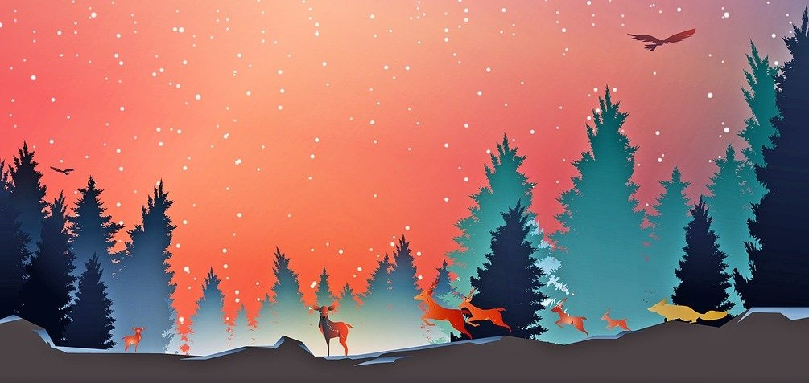
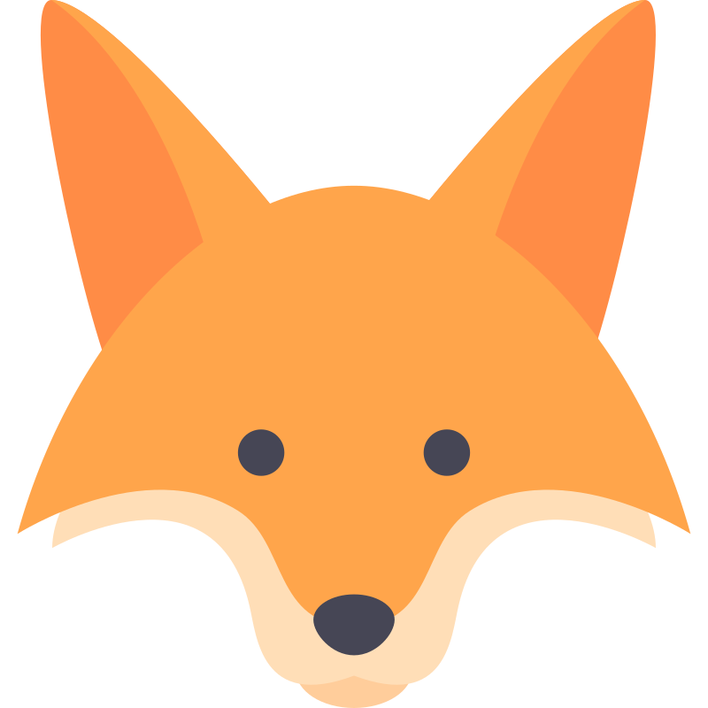
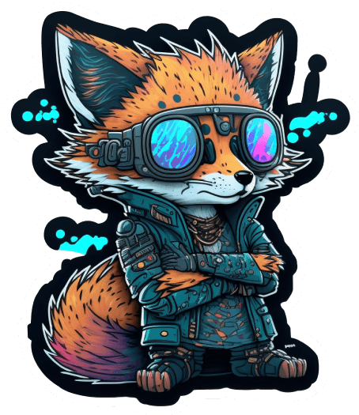

&nbsp;

**Tecnologia**, **desenvolvimento de software** e **novações**. Tudo em nosso mundo atual faz minha
imaginação voar, admirando as possibilidades do que se pode fazer e como o futuro, provavelmente, será.

<!-- Section separator -->

  &nbsp;
  
   

<!-- Sticker at the right -->

<!-- A simple list of what I like and goals -->

   

:fox_face:&nbsp; **Wederson de Oliveira Calixto**, também, conhecido como **Hanssell a raposa** nas redes sociais e por amigos. 

:fox_face:&nbsp; Estudante de **Engenharia de Software**, focado em **Desenvolvimento de Sistemas**, **Qualidade de software** e **Segurança de processos**. 

:bookmark:&nbsp; Sempre lendo artigos e livros sobre **desenvolvimento** e **boas práticas** 

:bookmark:&nbsp; Estudo línguas estrangeiras como um passatempo. 

:two_hearts:&nbsp; Gosto de usar qualquer qualquer tipo de tecnologia quando estou praticando em meus projetos pessoais. 

:two_hearts:&nbsp;Admiro **raposas**, amo um bom **café** :coffee: e **aprender** coisas novas. 

<!-- Contact links -->
 

&nbsp;

